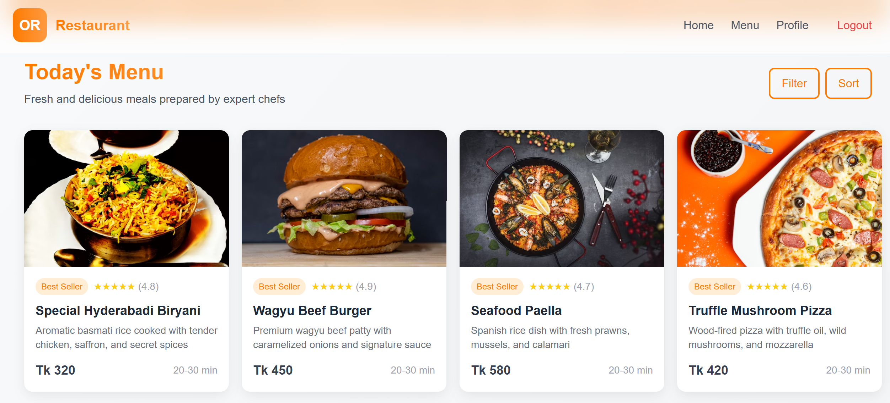
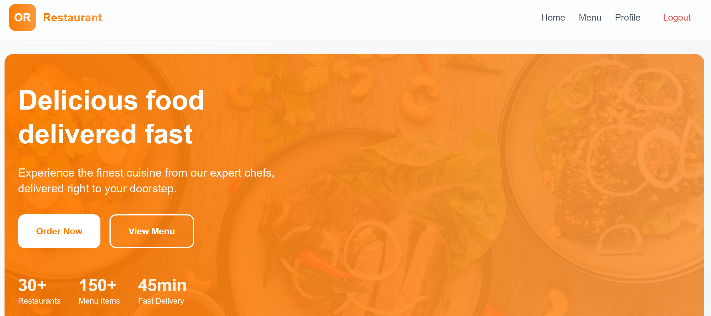

# 🍽️ Modern Restaurant App

A beautiful, full-featured restaurant ordering system built with the MERN stack (MongoDB, Express, React, Node.js). Features a modern UI with real-time order tracking, user authentication, and a smooth ordering experience.




## ✨ Features

- 🎨 Modern, responsive UI with orange & white theme
- 🔐 User authentication (signup/login)
- 🛒 Shopping cart with persistent storage
- 🍔 Dynamic menu with food items
- 💳 Order placement with voucher support
- 📍 Real-time order tracking
- ⭐ Rating system for orders
- 👤 User profile management
- 📱 Mobile-friendly design

## 🚀 Quick Start Guide

### Prerequisites

Before you begin, make sure you have the following installed:
1. [Node.js](https://nodejs.org/) (v14 or newer)
2. [MongoDB](https://www.mongodb.com/try/download/community) (Local or Atlas URI)
3. [Git](https://git-scm.com/downloads)

### Step 1: Clone the Repository

```bash
# Clone this repository
git clone https://github.com/tonoyx91/or-restaurant.git

# Navigate to the project folder
cd or-restaurant
```

### Step 2: Set Up the Server

1. Navigate to the server directory:
```bash
cd server
```

2. Create a `.env` file in the server directory:
```bash
# For Windows
copy NUL .env

# For Mac/Linux
touch .env
```

3. Add these environment variables to the `.env` file:
```env
MONGO_URI=mongodb://localhost:27017/restaurant
JWT_SECRET=your-secret-key-here
PORT=5000
```

4. Install dependencies and start the server:
```bash
# Install dependencies
npm install

# Seed the database with sample data
npm run seed

# Start the development server
npm run dev
```

The server will start at `http://localhost:5000`

### Step 3: Set Up the Client

1. Open a new terminal and navigate to the client directory:
```bash
cd client
```

2. Install dependencies and start the development server:
```bash
# Install dependencies
npm install

# Start the development server
npm run dev
```

The client will start at `http://localhost:3000`

## 🎯 How to Use

1. **Register/Login**:
   - Click the "Login" button in the navbar
   - Create a new account or login with existing credentials

2. **Browse Menu**:
   - View all food items on the home page
   - Click on items to see details
   - Use the + button to add items to cart

3. **Place Order**:
   - Click the cart icon to view your cart
   - Add delivery details
   - Use voucher code "SAVE23" for 23% off
   - Click "Place Order" to confirm

4. **Track Order**:
   - After placing an order, a tracker appears
   - Watch real-time progress for 3 minutes
   - Rate your order after delivery

## 💡 Pro Tips

- **Voucher Code**: Use `SAVE23` for 23% off your order
- **Order Status**: Track your order in real-time with the floating tracker
- **Profile**: View order history and manage your details in the profile section
- **Ratings**: Help others by rating your delivered orders

## 📁 Project Structure

```
restaurant-app/
├── client/                 # Frontend React application
│   ├── src/
│   │   ├── components/    # Reusable UI components
│   │   ├── context/      # React Context providers
│   │   ├── pages/        # Main page components
│   │   ├── services/     # API and utility services
│   │   └── types/        # TypeScript type definitions
│   │
│   ├── public/           # Static assets
│   └── package.json      # Frontend dependencies
│
└── server/               # Backend Node.js application
    ├── src/
    │   ├── models/      # MongoDB models
    │   ├── routes/      # API routes
    │   ├── middleware/  # Express middleware
    │   └── config.js    # Server configuration
    │
    ├── .env             # Environment variables
    └── package.json     # Backend dependencies
```

## 🔧 Configuration Options

### Server (`.env` file)
```env
MONGO_URI=mongodb://localhost:27017/restaurant
JWT_SECRET=your-secret-key
PORT=5000
```

### Client (`client/.env` file)
```env
VITE_API_BASE=http://localhost:5000/api
```

## 🤝 Contributing

Contributions are welcome! Please feel free to submit a Pull Request.

## ❓ Common Issues & Solutions

1. **MongoDB Connection Error**:
   - Ensure MongoDB is running locally or use MongoDB Atlas
   - Check your MONGO_URI in the .env file

2. **Node.js Version Error**:
   - Use Node.js version 14 or newer
   - Run `node -v` to check your version

3. **Port Already in Use**:
   - Change the port in server/.env
   - Kill the process using the port: `npx kill-port 5000`

4. **NPM Install Fails**:
   - Clear npm cache: `npm cache clean --force`
   - Delete node_modules and run `npm install` again

## 📫 Support

Need help? Create an issue or contact me at [github.com/tonoyx91](https://github.com/tonoyx91)
